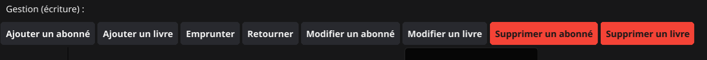
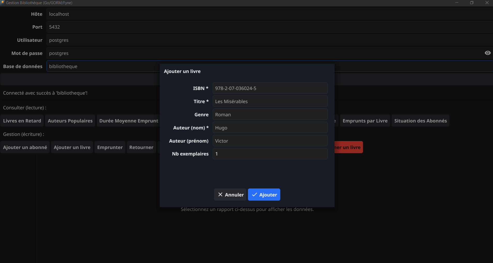
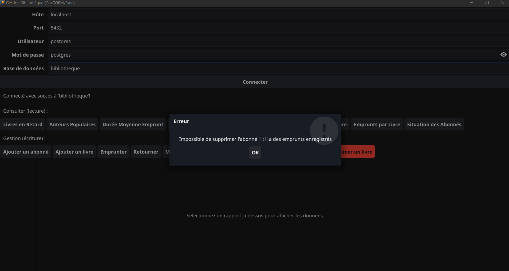

# Library Management

[](https://github.com/NizarLakhder/library-management/actions/workflows/ci.yml)


A desktop library management application built with Go and Fyne, using PostgreSQL as the database backend.

---

## Screenshots

### Browse (read)

| Login | Overdue loans | Member status |
|:---:|:---:|:---:|
|  |  |  |

### Manage (write)

| Management actions | Add a book | Delete refused (data integrity) |
|:---:|:---:|:---:|
|  |  |  |

---

## Features

**Read (reports)**

- Connect to a PostgreSQL database via a login form
- View **overdue loans** (unreturned after 14 days)
- Rank **most popular authors** by number of loans
- Calculate **average loan duration**
- List **books never borrowed**
- **Loans by year** statistics
- **Loans by literary genre** breakdown
- **Loans per book** count
- **Member status** overview (active loans, overdue)

**Manage (writes)**

- **Add / edit / delete a member** — deletion is refused if the member has loan history
- **Add / edit / delete a book** — creation and deletion are transactional; deletion is refused if a copy has loan history
- **Borrow** a copy (refused if it is already on loan)
- **Return** a copy

---

## Tech Stack

| Component | Technology |
|-----------|-------------|
| Language  | Go 1.24+    |
| UI        | [Fyne v2](https://fyne.io/) |
| ORM       | [GORM v1](https://gorm.io/) |
| Database  | PostgreSQL 17 |

---

## Prerequisites

1. **Go 1.24.2+** — [golang.org/dl](https://golang.org/dl/)
2. **PostgreSQL** — [postgresql.org/download](https://www.postgresql.org/download/)
3. **C compiler** (required by Fyne via CGo)
   - Windows: [MinGW-w64](https://www.mingw-w64.org/)
   - macOS: Xcode Command Line Tools (`xcode-select --install`)
   - Linux: `gcc` (`apt install gcc`)
4. **Fyne system dependencies** — see [docs.fyne.io/started](https://docs.fyne.io/started/)

---

## Installation

### 1. Clone the repository

```bash
git clone https://github.com/NizarLakhder/library-management.git
cd library-management
```

### 2. Download Go dependencies

```bash
go mod download
```

### 3. Set up the database

```bash
psql -U postgres -c "CREATE DATABASE bibliotheque;"
psql -U postgres -d bibliotheque -f schema.sql
psql -U postgres -d bibliotheque -f seed.sql
```

### 4. Run the application

**Recommended** — build then run (faster startup):

```bash
go build -o bibliotheque.exe .
.\bibliotheque.exe
```

**Quick alternative** — run without building (slower startup):

```bash
go run main.go
```

---

## Login

On startup, enter your database credentials in the login form:

| Field    | Example value  |
|----------|----------------|
| Host     | `localhost`    |
| Port     | `5432`         |
| User     | `postgres`     |
| Password | `postgres`     |
| Database | `bibliotheque` |

> Only **Host** and **Port** are pre-filled; enter the rest to match your setup.

---

## Project Structure

The code is split by responsibility under `internal/`, keeping the database and
query logic free of any UI dependency (so it builds and tests without CGo):

```
library-management/
├── assets/                  # icon + screenshots
├── internal/
│   ├── models/              # GORM entities mapped to the SQL schema
│   ├── database/            # DSN building, connection, validation (+ tests)
│   ├── queries/             # the 8 analytical reports (+ unit & integration tests)
│   ├── commands/            # write operations: add/edit/delete, borrow/return (+ unit & integration tests)
│   └── ui/                  # Fyne window, form, table, dialogs
├── main.go                  # entry point — wires queries into the UI
├── schema.sql               # schema (DDL)
├── seed.sql                 # seed data
├── LICENSE
├── go.mod
└── go.sum
```

## Tests

```bash
# Fast unit tests (no database required)
go test ./...

# Integration tests against a real PostgreSQL instance (reports + CRUD cycle)
TEST_DB_HOST=localhost TEST_DB_PORT=5432 TEST_DB_USER=postgres \
TEST_DB_PASSWORD=postgres TEST_DB_NAME=bibliotheque \
go test -tags integration ./internal/queries/ ./internal/commands/
```
