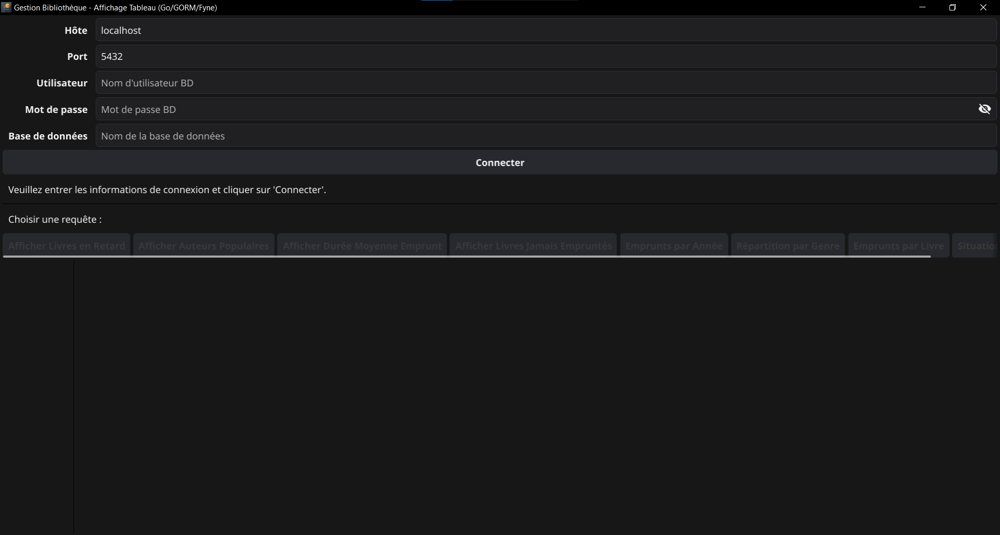
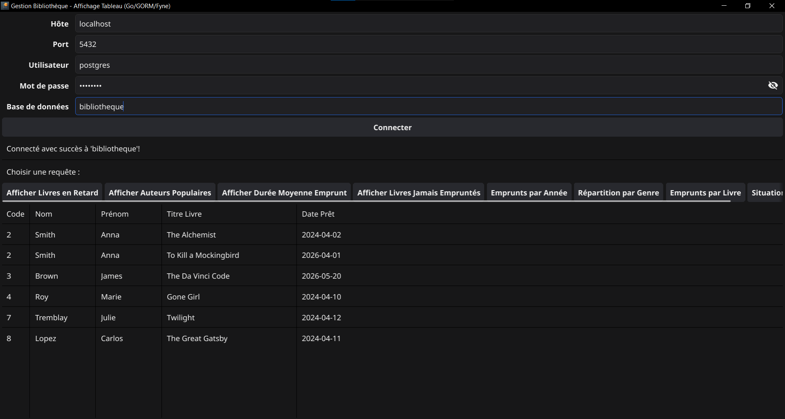
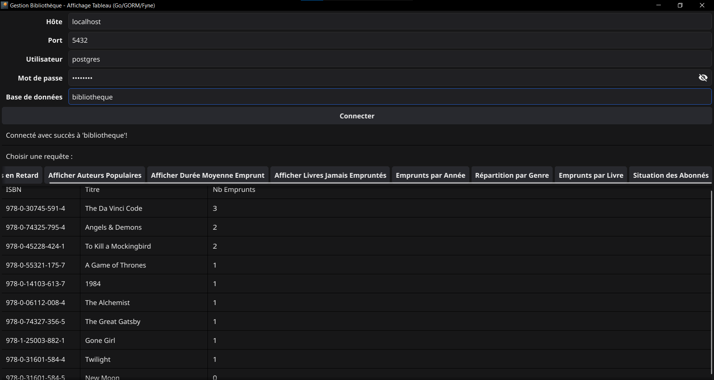
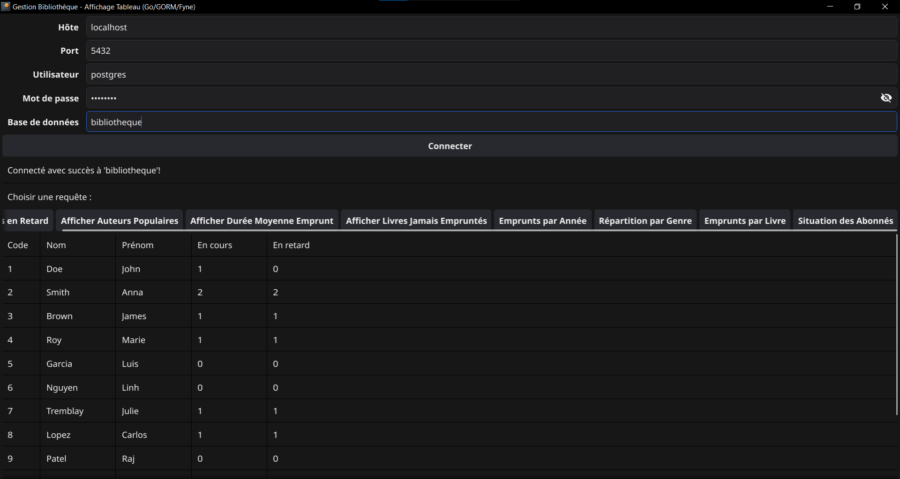

# Library Management


A desktop library management application built with Go and Fyne, using PostgreSQL as the database backend.

---

## Screenshots

| Login | Overdue Books |
|:---------:|:----------------:|
|  |  |

| Loans per Book | Member Status |
|:-----------------:|:--------------------:|
|  |  |

---

## Features

- Connect to a PostgreSQL database via a login form
- View **overdue loans** (unreturned after 14 days)
- Rank **most popular authors** by number of loans
- Calculate **average loan duration**
- List **books never borrowed**
- **Loans by year** statistics
- **Loans by literary genre** breakdown
- **Loans per book** count
- **Member status** overview (active loans, overdue)

---

## Tech Stack

| Component | Technology |
|-----------|-------------|
| Language  | Go 1.24+    |
| UI        | [Fyne v2](https://fyne.io/) |
| ORM       | [GORM v1](https://gorm.io/) |
| Database  | PostgreSQL 17 |

---

## Prerequisites

1. **Go 1.24.2+** — [golang.org/dl](https://golang.org/dl/)
2. **PostgreSQL** — [postgresql.org/download](https://www.postgresql.org/download/)
3. **C compiler** (required by Fyne via CGo)
   - Windows: [MinGW-w64](https://www.mingw-w64.org/)
   - macOS: Xcode Command Line Tools (`xcode-select --install`)
   - Linux: `gcc` (`apt install gcc`)
4. **Fyne system dependencies** — see [docs.fyne.io/started](https://docs.fyne.io/started/)

---

## Installation

### 1. Clone the repository

```bash
git clone https://github.com/NizarLakhder/library-management.git
cd library-management
```

### 2. Download Go dependencies

```bash
go mod download
```

### 3. Set up the database

```bash
psql -U postgres -c "CREATE DATABASE bibliotheque;"
psql -U postgres -d bibliotheque -f library.sql
psql -U postgres -d bibliotheque -f remplirTables.sql
```

### 4. Run the application

**Recommended** — build then run (faster startup):

```bash
go build -o bibliotheque.exe .
.\bibliotheque.exe
```

**Quick alternative** — run without building (slower startup):

```bash
go run main.go
```

---

## Login

On startup, enter your database credentials in the login form:

| Field    | Default value  |
|----------|----------------|
| Host     | `localhost`    |
| Port     | `5432`         |
| User     | `postgres`     |
| Password | `postgres`     |
| Database | `bibliotheque` |

---

## Project Structure

```
library-management/
├── assets/
│   ├── icon.png
│   ├── screenshot_connexion.png
│   ├── screenshot_retard.png
│   ├── screenshot_emprunts_livr.png
│   └── screenshot_situation.png
├── main.go
├── library.sql
├── remplirTables.sql
├── LICENSE
├── go.mod
└── go.sum
```
